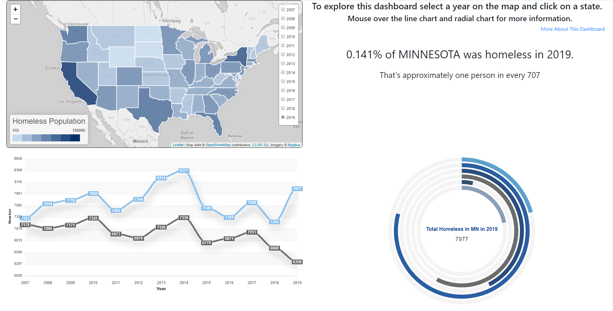

# Homelessness-In-USA

This Dashboard visualizes data from the Department of Housing and Urban Development (HUD) on point in time counts (PIT) and housing inventory counts (HIC) from 2007 to 2019.

[Here is a link to the data source.](https://www.hudexchange.info/resource/3031/pit-and-hic-data-since-2007/ "HUD website")

